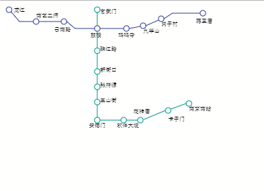

### 一周一文
----
#### 南京地铁（四号线、一号线）
----
> 代码如下

``` html
<!DOCTYPE html>
<html lang="en" dir="ltr">
  <head>
    <meta charset="utf-8">
    <title></title>
  </head>
  <body>
    <canvas id="canvas" width="300" height="300"></canvas>
    <script>
      var canvas = document.getElementById('canvas');
      if(canvas.getContext) {
        var c = canvas.getContext('2d');
        c.font = '8px serif';
        c.fillText('龙江',12,8);
        c.fillText('南艺二师',44,16);
        c.fillText('云南路',70,36);
        c.fillText('鼓楼',122,44);
        c.fillText('鸡鸣寺',162,44);
        c.fillText('九华山',198,38);
        c.fillText('岗子村',224,28);
        c.fillText('蒋王庙',274,24);

        c.fillText('玄武门',136,10);
        c.fillText('珠江路',136,64);
        c.fillText('新街口',136,94);
        c.fillText('张府源',136,116);
        c.fillText('三山街',136,138);
        c.fillText('安德门',120,174);

        c.fillText('软件大道',160,174);
        c.fillText('花神庙',184,154);

        c.fillText('卡子门',234,165);
        c.fillText('南京南站',264,150);

        c.beginPath();
        c.arc(5,5,4,0,2*Math.PI,false);
        c.moveTo(8,8);
        c.lineTo(20,22);
        c.lineTo(40,22);
        c.moveTo(48,22)
        c.arc(44,22,4,0,2*Math.PI,false);
        c.lineTo(80,22)
        c.moveTo(88,22)
        c.arc(84,22,4,0,2*Math.PI,false);
        c.lineTo(100,32)
        c.lineTo(128,32)
        c.moveTo(136,32)
        c.arc(132,32,4,0,2*Math.PI,false)
        c.lineTo(170,32)
        c.moveTo(178,32)
        c.arc(174,32,4,0,2*Math.PI,false)
        c.lineTo(194,29)
        c.moveTo(202,28)
        c.arc(198,28,4,0,2*Math.PI,false);
        c.lineTo(220,20);
        c.moveTo(228,18);
        c.arc(224,18,4,0,2*Math.PI,false)
        c.lineTo(240,10)
        c.lineTo(280,10)
        c.moveTo(288,10)
        c.arc(284,10,4,0,2*Math.PI,false)
        c.closePath()
        c.strokeStyle = '#2f3f98';
        c.stroke()

        c.beginPath()
        c.arc(132,5,4,0,2*Math.PI,false)
        c.moveTo(132,8)
        c.lineTo(132,28)
        c.moveTo(132,36)
        c.lineTo(132,60)
        c.moveTo(136,64)
        c.arc(132,64,4,0,2*Math.PI,false)
        c.moveTo(132,68)
        c.lineTo(132,90)
        c.moveTo(136,94)
        c.arc(132,94,4,0,2*Math.PI,false)
        c.moveTo(132,98);
        c.lineTo(132,112);
        c.moveTo(136,116)
        c.arc(132,116,4,0,2*Math.PI,false)
        c.moveTo(132,120)
        c.lineTo(132,134)
        c.moveTo(136,138)
        c.arc(132,138,4,0,2*Math.PI,false)
        c.moveTo(132,142)
        c.lineTo(132,160)
        c.moveTo(136,164)
        c.arc(132,164,4,0,2*Math.PI,false)
        c.lineTo(166,164)
        c.moveTo(174,164)
        c.arc(170,164,4,0,2*Math.PI,false)
        c.lineTo(190,164)
        c.moveTo(198,164)
        c.arc(194,164,4,0,2*Math.PI,false)
        c.moveTo(199,163)
        c.lineTo(230,150)
        c.moveTo(238,150)
        c.arc(234,150,4,0,2*Math.PI,true)
        c.moveTo(238,148)
        c.lineTo(260,140)
        c.moveTo(268,140)
        c.arc(264,140,4,0,2*Math.PI,true)
        c.strokeStyle = '#009688';
        c.stroke()
      }
    </script>
  </body>
</html>
```
> 效果图

