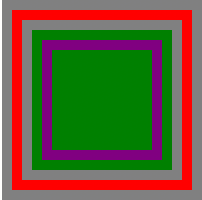
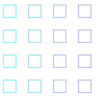
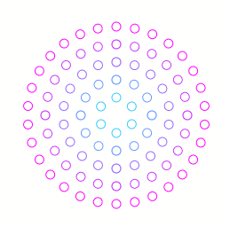
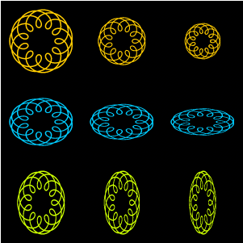
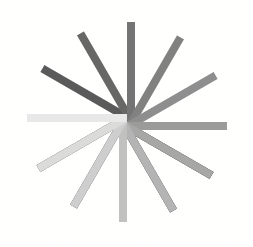

### 一周一文
----
#### canvas 变形
----
##### 状态的保存和恢复
`save() restore()` save和restore方法是用来保存、恢复canvas状态的
> canvas状态是当前应用的样式和变形的一个快照

canvas状态保存在栈中，每次调用`save()`都会把当前状态保存到栈中，可以多次调用`save()`方法；每次调用`restore()`方法，都会把状态从栈中弹出,所有设定都恢复；

canvas状态包括：
1. 当前应用的变形（伸缩，移动，旋转等）；
2. 当前的裁剪路径；
3. strokeStyle,fillStyle,globalAlpha,lineWidth,lineCap,lineJoin,miterLimit,
shadowOffsetX,shadowOffsetY,shadowColor,shadowBlur,globalCompositeOperation等；

实例如下：
```javascript
var canvas = document.getElementById('canvas');
if(canvas.getContext) {
  var c = canvas.getContext('2d');
  c.fillStyle = 'gray';
  c.fillRect(10,10,200,200);
  c.save();
  c.fillStyle = 'red'
  c.fillRect(20,20,180,180);
  c.restore();
  c.fillRect(30,30,160,160)
  c.save();
  c.fillStyle = 'green'
  c.fillRect(40,40,140,140);
  c.save()
  c.fillStyle = 'purple';
  c.fillRect(50,50,120,120);
  c.restore()
  c.fillRect(60,60,100,100)
}
```
效果图：



----

##### 移动
> `translate(x,y)`移动canvas图片和他的原点到一个新的坐标位置（x,y）；x：左右偏移量；y：上下偏移量；

> *注：变形之前先`save()`保存状态是一个良好的习惯；*

实例代码：
```javascript
for(var i=0;i<4;i++) {
  for(var j=0;j<4;j++) {
    c.save();
    c.strokeStyle = 'rgb(' + 51 * i + ',' + 255-51*i + ',255)';
    c.translate(10+50*i,10+50*j);
    c.strokeRect(0,0,25,25);
    c.restore()
  }
}
```
效果图：



----

##### 旋转
> `rotate(angle)`以原点为中心旋转canvas图片；

> *注：旋转中心点是原点，可以通过`translate(x,y)`方法改变旋转中心点；以顺时针方向为正值；单位是弧度；*

实例代码：
```javascript
if(canvas.getContext) {
  var c = canvas.getContext('2d');
  c.translate(175,175);
  for(var i=1;i<6;i++) {
    c.save();
    // c.fillStyle = 'rgb('+ 51*i + ',' + (255-51*i) +',255)';
    c.strokeStyle = 'rgb('+ 51*i + ',' + (255-51*i) +',255)';
    for(var j=0;j<6*i;j++) {
      c.rotate(Math.PI*2/(6*i));
      c.beginPath();
      c.arc(0,20*i,5,0,Math.PI*2,true);
      // c.fill();
      c.stroke();
    }
    c.restore();
}
```

效果图：



----

##### 缩放

> `scale(x,y)` x,y分别是横轴和纵轴的缩放因子；

实例代码：

```javascript
if(canvas.getContext) {
  var ctx = canvas.getContext('2d');
  ctx.strokeStyle = "#fc0";
  ctx.lineWidth = 1.5;
  ctx.fillRect(0,0,300,300);

  // Uniform scaling
  ctx.save()
  ctx.translate(50,50);
  drawSpirograph(ctx,22,6,5);  // no scaling

  ctx.translate(100,0);
  ctx.scale(0.75,0.75);
  drawSpirograph(ctx,22,6,5);

  ctx.translate(133.333,0);
  ctx.scale(0.75,0.75);
  drawSpirograph(ctx,22,6,5);
  ctx.restore();

  // Non-uniform scaling (y direction)
  ctx.strokeStyle = "#0cf";
  ctx.save()
  ctx.translate(50,150);
  ctx.scale(1,0.75);
  drawSpirograph(ctx,22,6,5);

  ctx.translate(100,0);
  ctx.scale(1,0.75);
  drawSpirograph(ctx,22,6,5);

  ctx.translate(100,0);
  ctx.scale(1,0.75);
  drawSpirograph(ctx,22,6,5);
  ctx.restore();

  // Non-uniform scaling (x direction)
  ctx.strokeStyle = "#cf0";
  ctx.save()
  ctx.translate(50,250);
  ctx.scale(0.75,1);
  drawSpirograph(ctx,22,6,5);

  ctx.translate(133.333,0);
  ctx.scale(0.75,1);
  drawSpirograph(ctx,22,6,5);

  ctx.translate(177.777,0);
  ctx.scale(0.75,1);
  drawSpirograph(ctx,22,6,5);
  ctx.restore();

}
function drawSpirograph(ctx,R,r,O){
  var x1 = R-O;
  var y1 = 0;
  var i    = 1;
  ctx.beginPath();
  ctx.moveTo(x1,y1);
  do {
      if (i>20000) break;
      var x2 = (R+r)*Math.cos(i*Math.PI/72) - (r+O)*Math.cos(((R+r)/r)*(i*Math.PI/72))
      var y2 = (R+r)*Math.sin(i*Math.PI/72) - (r+O)*Math.sin(((R+r)/r)*(i*Math.PI/72))
      ctx.lineTo(x2,y2);
      x1 = x2;
      y1 = y2;
      i++;
  } while (x2 != R-O && y2 != 0 );
  ctx.stroke();
```

效果图：



##### 变形
1. `tranform(m11,m12,m21,m22,dx,dy)` 允许对变形矩阵进行修改；

  **参数备注**
  * m11: 水平方向缩放
  * m12: 水平方向的倾斜偏移
  * m21: 垂直方向的倾斜偏移
  * m22: 垂直方向缩放
  * dx: 水平方向的移动
  * dy: 垂直方向的移动


2. `setTransform(m11,m12,m21,m22,dx,dy)` 将当前的变形矩阵重置为单位矩阵，然后用相同的参数调用`transform`方法；
3. `resetTransfomr(m11,m12,m21,m22,dx,dy)` 重置当前变形矩阵为单位矩阵；等价于 `setTransform(1,0,0,1,0,0)`;

```javascript
if(canvas.getContext) {
  var ctx = document.getElementById('canvas').getContext('2d');
  var sin = Math.sin(Math.PI/6);
  var cos = Math.cos(Math.PI/6);
  ctx.translate(200, 200);
  var c = 0;
  for (var i=0; i <= 18; i++) {
    c = Math.floor(155 / 12 * i);
    ctx.fillStyle = "rgb(" + c + "," + c + "," + c + ")";
    ctx.fillRect(0, 0, 100, 8);
    ctx.transform(cos, sin, -sin, cos, 0, 0);
  }
  ctx.setTransform(-1, 0, 0, 1, 100, 100);
}
```

效果图：




----
